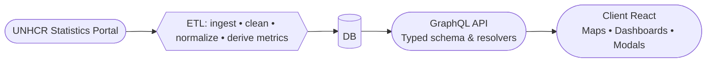

# Beyond Footsteps — Migration Data Explorer (Client)

<p align="center">
  
</p>
<p align="center">
  <a href="https://github.com/ezepsosa/beyondfootsteps-client/blob/main/LICENSE">
    
  </a>
  <a href="https://github.com/ezepsosa/beyondfootsteps-client">
    
  </a>
  
  
</p>

Beyond Footsteps is a portfolio project that makes global migration and refugee data from the United Nations High Commissioner for Refugees (UNHCR) easier to explore through interactive maps and clear visual summaries. The goal is to help users quickly understand patterns of human mobility (applications, decisions, displacement) without digging through complex datasets.

This repository contains the web client (frontend). The project also includes:

- ETL pipeline: https://github.com/ezepsosa/beyondfootsteps-api
- GraphQL API: https://github.com/ezepsosa/beyondfootsteps-api

> This project is not affiliated with UNHCR. It is intended for educational and portfolio purposes.

---

## Table of Contents

- Problem & Goals
- Architecture Overview
- Data Sources & Licensing
- ETL Overview
- GraphQL API Overview
- Client (this repo)
  - Features
  - Tech Stack
  - Requirements
  - Environment Variables
  - Install & Run
  - Project Structure
  - Maps & Attribution
  - Resettlement Visualizations
- Design & Implementation Notes
- About & Branding
- Roadmap
- Acknowledgements

---

## Problem & Goals

Migration statistics are often fragmented, technical, and hard to visualize. This project:

- Aggregates UNHCR datasets into a consistent, queryable model
- Visualizes indicators on an interactive world map (Leaflet)
- Provides country-level summaries and CSV export
- Focuses on clarity and usability over exhaustive analytics

This is a single-developer portfolio project designed to showcase end‑to‑end implementation: ETL → API → Client.

---

## Architecture Overview



If you can’t see the diagram (e.g., local preview), here’s a text fallback:

```text
UNHCR Statistics Portal
   └─> ETL (ingest • clean • normalize • derive metrics)
         └─> DB
               └─> GraphQL API (typed schema & resolvers)
                     └─> Client (React: maps • dashboards • modals)
```

## Data Sources & Licensing

- Primary data: UNHCR (United Nations High Commissioner for Refugees)
- Always review and comply with the source terms of use and attribution requirements.

Map tiles and attribution (HOT/OSM):

- Tiles: https://{s}.tile.openstreetmap.fr/hot/{z}/{x}/{y}.png
- Required attribution shown in the app:

```html
&copy;
<a href="https://www.hotosm.org/">Humanitarian OpenStreetMap Team</a> &copy;
<a href="https://osm.org/copyright">OpenStreetMap</a> contributors
```

---

## ETL Overview

Scope (portfolio‑scale, pragmatic):

- Ingestion: periodic extraction from UNHCR statistics portal
- Normalization:
  - Country code alignment (ISO 3166, CCA3) for stable joins and mapping
  - Type normalization (numbers/percentages/flags)
  - Harmonized field names across datasets
- Derived metrics:
  - acceptanceRate, appliedPer100k, displacementRatePer100k, etc.
- Data quality:
  - Missing values handled explicitly (“N/A” or nulls)
  - Flags for aggregated counts (e.g., `decPc`)
  - Year ranges and duplicates validated

References (placeholders):

- ETL repository: https://github.com/ezepsosa/beyondfootsteps-etl
- ETL docs (pipeline, schemas, schedules): Not available yet.

---

## GraphQL API Overview

Client consumes a GraphQL endpoint and uses generated TypeScript types (`src/gql/graphql.ts`).

GraphQL endpoint (placeholder):

```
https://api.example.com/graphql
```

Example query:

```graphql
query GetAsylumDecisionsByYearAndCountry(
  $year: Int!
  $countryOfAsylumIso: String
  $countryOfOriginIso: String
) {
  asylumDecisionsByYearAndCountry(
    year: $year
    countryOfAsylumIso: $countryOfAsylumIso
    countryOfOriginIso: $countryOfOriginIso
  ) {
    id
    year
    acceptanceRate
    decRecognized
    decRejected
    countryOfAsylumIso
    countryOfOriginIso
  }
}
```

API repository:

- GraphQL API: https://github.com/ezepsosa/beyondfootsteps-api

---

## Client (this repo)

### Features

- World map with color scales and metric markers (Leaflet)
- Country info modal with key indicators
- Year and direction (origin/asylum) selectors
- CSV export for the current filtered dataset
- 404 and About pages with non‑interactive background map

### Main Features

- **Interactive World Map:**  
  Explore migration and refugee data by country, year, and direction (origin/asylum). Color scales and markers show key indicators.

- **Country Indicators & Dashboards:**  
  View summaries for each country, including asylum decisions, requests, population, and derived metrics.

- **Asylum Decisions & Requests:**  
  Visualize trends and breakdowns for applications, decisions, recognition rates, and more.

- **Resettlement Visualizations:**  
  Coverage rate, pipeline, efficiency, gap, flows (Sankey), and trends for resettlement data.

- **CSV Export:**  
  Download filtered datasets for further analysis.

---

### Visualization Details

#### Asylum Decisions & Requests

- Bar and line charts for applications, decisions, recognition rates, and trends.
- Filters by year, country of origin/asylum, and other dimensions.

#### Resettlement

- Coverage Rate, Pipeline, Efficiency Scatter, Gap, Sankey Flows, and Trends.
- Flexible grouping and filtering.

#### Map Features

- Interactive map with color scales, tooltips, and country selection.
- Non-interactive background map for About/404 pages.

---

### Technical Highlights

- All charts use generic grouping for flexibility.
- Backend aggregation for performance.
- Consistent filtering, paginación, and outlier handling.
- Responsive layouts and accessibility.
- Apollo Client and React Query for data fetching.

### Tech Stack

- React + TypeScript
- react‑leaflet (Leaflet)
- Styled Components
- Chart.js (for charts where applicable, including Sankey plugin)
- GraphQL codegen types (local TS types from schema)

### Requirements

- Node.js ≥ 18
- npm / pnpm / yarn (examples below use npm)

### Environment Variables

If you use path aliases (`@/`), ensure they are configured in `tsconfig.json` and your bundler config.

### Install & Run

```bash
# Install dependencies
npm install

# Start dev server
npm run dev

# Production build
npm run build

# Preview production build
npm run preview
```

### Project Structure (excerpt)

```
src/
├─ components/
│  ├─ map/
│  │  ├─ container/           # MapComponent (MapContainer + TileLayer)
│  │  ├─ layer/               # GeoJSONLayer, MetricLayer, etc.
│  │  └─ modal/               # Country/KPI modals
│  ├─ selectorBar/
│  ├─ colourLegend/
│  └─ ...
├─ gql/                        # GraphQL generated types
├─ pages/
│  ├─ dashboard/
│  ├─ asylumDecisions/
│  ├─ asylumRequests/
│  ├─ resettlements/
│  ├─ notFound/
│  └─ aboutus/
├─ styles/
└─ assets/
```

### Maps & Attribution

Default tiles in use:

```tsx
<TileLayer
  url="https://{s}.tile.openstreetmap.fr/hot/{z}/{x}/{y}.png"
  attribution='&copy; <a href="https://www.hotosm.org/">Humanitarian OpenStreetMap Team</a> &copy; <a href="https://osm.org/copyright">OpenStreetMap</a> contributors'
  maxZoom={18}
/>
```

To render a non‑interactive background map (e.g., About or 404 pages), disable interactions on the Leaflet `MapContainer` (or in your wrapper):

- dragging={false}
- scrollWheelZoom={false}
- doubleClickZoom={false}
- touchZoom={false}
- keyboard={false}

This allows the page to scroll normally while the map is visible in the background.

---

## Design & Implementation Notes

- Country markers are positioned using precomputed centroids keyed by ISO‑3.
- Color scales are exposed with a legend component for quick interpretation.
- Numeric values are humanized for readability (“44”, “0.63”, “0.08”, or “N/A”).
- Path aliases (`@/...`) simplify imports; ensure `tsconfig.json` and bundler alias match.
- The client uses generated GraphQL types in `src/gql/graphql.ts` for strong typing.
- Resettlement visualizations use backend aggregation and generic grouping for flexibility and performance.

---

## About & Branding

- The About page includes a non‑interactive background map and logos for Beyond Footsteps and UNHCR (with an external link to UNHCR).
- Branding and copy are aligned with the project’s purpose as a personal portfolio.
- The project explicitly states it is not affiliated with UNHCR.

---

## Acknowledgements

- Data: © UNHCR (ACNUR) — https://www.unhcr.org/
- Map tiles: © Humanitarian OpenStreetMap Team — https://www.hotosm.org/
- Map data: © OpenStreetMap contributors — https://www.openstreetmap.org/copyright

This project is not affiliated with UNHCR. It is intended for educational and portfolio purposes.
